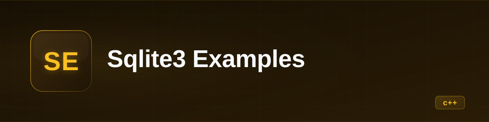
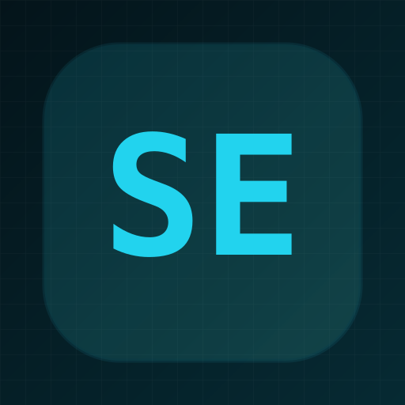

<p align="center">
  
</p>

<p align="center">
  
</p>

<h1 align="center">sqlite3_examples</h1>

<p align="center"><b>C++ examples of SQLite3 usage via the C API — from basic queries to full CRUD menus.</b></p>

<p align="center">
  
  
  
  
</p>

---

## What it is

A set of standalone C++ programs that demonstrate how to use the SQLite3 C API directly. Each file in `src/` is an independent example, compiled separately, covering progressively more complex patterns: opening a database, creating tables, inserting and querying data with `sqlite3_exec`, using prepared statements with `sqlite3_prepare_v2`/`sqlite3_bind`, and building interactive CRUD menus.

**In one sentence:** Educational SQLite3 C API examples in C++, built with CMake and auto-fetched dependencies.

## State

| | |
|---|---|
| **State** | experiment |
| **Last activity** | 2026-03 |
| **Usable today** | yes — verified 2026-09-22 from a clean clone: all six examples compile and `intro`, `queries_sensillo`, `queries_stmt` and `clase` run and produce expected output |
| **What's missing** | tests, error handling in some files, no license, SQL injection in `queries_sensillos` |
| **Known risks / debt** | `queries_sensillos` concatenates strings directly into SQL (injection vulnerability); no error checking in some `sqlite3_exec` calls; `clase.cpp` uses `system("cls")` / `system("pause")` (Windows-only) |

## Why it exists

Learning material for the SQLite3 C API. Each example isolates one concept (basic queries, prepared statements, CRUD operations) so you can read one file and understand one pattern without wading through a full application. Likely a university/course project.

## Demo

No demo included — each program is interactive and prints to stdout.

## Installation and usage

Prerequisites: CMake ≥ 4.0, a C++ compiler (g++/clang++), internet access (CMake downloads SQLite3 automatically).

```bash
cd repo
cmake -B build
cmake --build build
```

Each example compiles to a separate binary. Run any of them:

```bash
./build/intro          # basic open/create/insert/select
./build/queries_sensillo  # simple queries (string concatenation)
./build/queries_stmt   # prepared statements with bind
./build/clase          # full CRUD menu (bolitas de colores)
./build/ejemplo        # login/registration menu
./build/video          # tickets CRUD demo
```

Each program creates a `base.db` (or `amongas` / `datos.db`) SQLite file in the working directory.

## Stack

- **Language / runtime:** C++ (no language standard pinned in CMake — whatever the compiler defaults to), CMake ≥ 4.0
- **Dependencies:** SQLite3 amalgamation 3.51.2 (fetched automatically by CMake via `FetchContent`, SHA3-256 hash pinned)
- **CI:** GitHub Actions — the stock "CMake on a single platform" starter workflow (`build` + `ctest`); since no tests are defined, `ctest` currently runs zero tests, so CI only proves it compiles
- **What it does NOT use and why:** no ORM, no third-party wrappers — the point is to learn the raw C API

## Architecture

```
CMakeLists.txt          # Fetches sqlite3 amalgamation, compiles each src/*/*.cpp as a separate binary
src/
  introduccion/         # Basic: open DB, create table, insert, select with callback
  queries_sensillos/    # Simple queries via string concatenation (educational, not production-safe)
  queries_complejos/    # Prepared statements: sqlite3_prepare_v2 + sqlite3_bind + sqlite3_step
  ABMC/                 # Full CRUD (Alta/Baja/Modificación/Consulta) with interactive menus
    clase.cpp           # "bolitas de colores" — insert, list, update, physical/logical delete
    ejemplo.cpp         # Login/registration with prepared statements
    video.cpp           # Tickets CRUD demo
```

## Repo structure

```
CMakeLists.txt              # Build config — auto-fetches sqlite3, builds all examples
src/introduccion/           # intro.cpp — basic SQLite3 usage
src/queries_sensillos/      # queries_sensillo.cpp — simple queries (string concat)
src/queries_complejos/      # queries_stmt.cpp — prepared statements
src/ABMC/                   # clase.cpp, ejemplo.cpp, video.cpp — CRUD menus
docs/overview.md            # Auto-generated overview
.github/workflows/          # CI: cmake-single-platform.yml
```

## Roadmap

- [ ] Add error handling to all examples (some `sqlite3_exec` calls ignore errors)
- [ ] Fix SQL injection in `queries_sensillos` (switch to prepared statements)
- [ ] Remove `system("cls")` / `system("pause")` from `clase.cpp` (not cross-platform)
- [ ] Add a LICENSE file
- [ ] Add basic tests or a `make test` target beyond the default ctest

## Notes and decisions

- SQLite3 is fetched via CMake `FetchContent` rather than requiring a system install — keeps the build self-contained.
- Each `.cpp` is a standalone `main()`, not a library. This is intentional for learning: read one file, run one binary.
- The naming follows Spanish conventions (`ABMC` = Alta/Baja/Modificación/Consulta, `queries_sensillos` keeps the author's original spelling) — this is the author's language.
- A previous README in the repo was auto-generated boilerplate (local clone paths, "detected stack") and has been replaced by this one, written from an actual read of the code.
- Note: the interactive examples create their SQLite file in the current working directory; running two of them from the same directory can trip each other up if they define the same table with different schemas.

## License

No license specified. Without a license, the code is visible but not open source.
